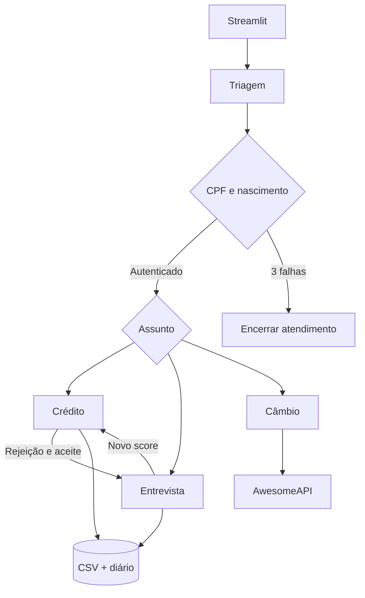

# Banco Ágil

Atendimento bancário fictício com quatro agentes de IA: triagem, crédito, entrevista financeira e câmbio. Interface de chat em português, Gemini para interpretação de linguagem, LangGraph para orquestração e ferramentas Python para todas as decisões financeiras.

## Visão geral

O cliente autentica com CPF e data de nascimento, consulta seu limite, solicita aumento, realiza uma entrevista para recalcular o score e consulta cotações externas. As transições entre especialistas são internas: a interface apresenta uma conversa única.

Este projeto é uma demonstração técnica local com dados fictícios. CPF e nascimento atendem ao mecanismo de autenticação pedido pelo desafio; não constituem autenticação adequada para um banco real.

## Execução

Requisitos: Git, [uv](https://docs.astral.sh/uv/getting-started/installation/) e acesso à API Gemini. O uv instala Python 3.12 caso necessário.

```powershell
git clone https://github.com/DanielPonttes/banco-agil.git
cd banco-agil
uv sync --locked --python 3.12
Copy-Item .env.example .env
```

No Linux/macOS, substituir o último comando por `cp .env.example .env`.

Editar `.env` localmente:

```dotenv
GEMINI_API_KEY=sua_chave_aqui
GEMINI_MODEL=gemini-3.8-flash
AWESOMEAPI_KEY=
DATA_DIR=data/runtime
LOG_LEVEL=INFO
```

Depois:

```powershell
uv run streamlit run app.py
```

Abrir http://localhost:8501. Nunca incluir chaves no Git. A execução normal usa Gemini real; não existe substituição silenciosa por respostas simuladas quando a API falha.

A AwesomeAPI pode ser usada sem chave, com possível cache de um minuto. Configurar `AWESOMEAPI_KEY` para acesso autenticado e verificar os limites da conta. A aplicação exibe o horário e a origem da cotação.

## Arquitetura



- **Apresentação:** histórico e estado próprios de cada sessão do Streamlit.
- **Orquestração:** quatro especialistas com ações restritas; um ciclo do grafo por mensagem.
- **Domínio:** autenticação, validação de valores, cálculo do score e comparação com faixas de limite.
- **Persistência:** CSVs validados, lock compartilhado, escrita por substituição e diário de recuperação.
- **Integrações:** SDK oficial Gemini e cliente HTTP de câmbio, ambos substituíveis por doubles nos testes.

O LLM interpreta intenção e campos. Identidade autenticada, aprovação, score e escrita são controlados por código. A ferramenta financeira recebe a identidade da sessão, nunca uma identidade escolhida pelo modelo. Não há acesso genérico a arquivos, shell ou URLs escolhidas pelo usuário.

## Funcionalidades

- Autenticação com CPF e nascimento; três falhas de correspondência encerram a sessão.
- Formato inválido pede correção sem consumir tentativa.
- Consulta do limite e solicitação de aumento.
- Aprovação atualiza o limite; rejeição preserva o limite anterior e oferece entrevista.
- Entrevista com renda, emprego, despesas, dependentes e dívidas.
- Confirmação antes de persistir o score e nova solicitação somente após aceite.
- Cotação com compra, venda, horário e fonte.
- Encerramento por comando ou botão, disponível durante todo o atendimento.
- Tratamento de falhas de entrada, arquivo e serviço externo.

## Dados e regras

Os exemplos ficam em `data/examples`; os arquivos de execução ficam em `DATA_DIR` e são ignorados pelo Git. A inicialização preserva dados existentes e não substitui arquivos corrompidos por exemplos.

| CSV | Colunas |
|---|---|
| clientes.csv | cpf_cliente,nome,data_nascimento,limite_atual,score |
| score_limite.csv | score_minimo,limite_maximo |
| solicitacoes_aumento_limite.csv | cpf_cliente,data_hora_solicitacao,limite_atual,novo_limite_solicitado,status_pedido |

CPF é texto; nascimento usa ISO; solicitações têm timestamp com timezone; dinheiro é calculado com `Decimal` e serializado com duas casas decimais. O arquivo de solicitações conserva as cinco colunas exigidas. O diário técnico auxiliar mantém recuperação e idempotência.

### Faixas fictícias

| Score mínimo | Limite máximo |
|---:|---:|
| 0 | R$ 500 |
| 300 | R$ 1.500 |
| 500 | R$ 3.000 |
| 700 | R$ 5.000 |
| 850 | R$ 10.000 |

Escolher o maior limiar menor ou igual ao score. Pedido até o máximo da faixa é aprovado. O valor solicitado é o limite total desejado e deve superar o limite atual.

### Score

```text
renda / (despesas + 1) × 30
+ emprego: formal=300, autônomo=200, desempregado=0
+ dependentes: 0=100, 1=80, 2=60, 3+=30
+ dívidas: sim=-100, não=100
```

Arredondamento `ROUND_HALF_UP`, limitado a 0–1000. Renda e despesas não podem ser negativas; dependentes devem ser inteiros não negativos. A entrevista pode aumentar ou diminuir o score.

### Decisões sobre ambiguidades do enunciado

- `rejeitado` é o status canônico; o enunciado também usa “reprovado”.
- Aprovar um pedido efetiva o novo limite em clientes.
- Pedido rejeitado permanece no histórico. Reanálise após entrevista gera outro pedido, com aceite.
- Encerrar uma consulta de câmbio não encerra automaticamente toda a conversa.
- Faixas e cadastro de exemplo são fictícios, pois os CSVs não acompanham o PDF.
- CPF é normalizado para 11 dígitos e comparado com a base, sem consulta a serviços de identidade.
- Uma sessão encerrada não pode ser reaberta; “Novo atendimento” inicia outra, sem autenticação.

## Testes

```powershell
uv run ruff check .
uv run pytest
uv run pytest --cov=banco_agil --cov-report=term-missing
```

A suíte padrão usa diretórios temporários e serviços simulados. Não exige credenciais nem altera os exemplos ou os dados de execução. O CI roda em Windows e Linux.

Cobertura funcional: autenticação, fronteiras de score, aprovação/rejeição, persistência, recuperação de transação, idempotência, roteamento, falhas de APIs e interface. A validação com chaves reais é separada da suíte determinística.

## Roteiro de demonstração

Usar os clientes fictícios disponíveis em `data/examples/clientes.csv` e na ajuda da interface.

1. Autenticar e perguntar “Qual é meu limite?”.
2. Pedir um limite dentro da faixa do cliente e consultar novamente para comprovar a atualização.
3. Com cliente de score 300 e limite R$ 1.000, pedir R$ 3.000. Aceitar a entrevista: renda R$ 5.000, emprego formal, despesas R$ 2.000, zero dependentes e sem dívidas. Confirmar o resumo. Score esperado: **575**. Aceitar nova solicitação de R$ 3.000.
4. Perguntar “Qual a cotação do dólar?” e conferir fonte e horário.
5. Iniciar outro atendimento, errar a autenticação três vezes e conferir encerramento.
6. Iniciar entrevista e usar “Encerrar atendimento”; nenhuma atualização incompleta deve ser gravada.

Para repetir com os dados iniciais, parar o app e apontar `DATA_DIR` para um diretório novo. Isso preserva o histórico anterior.

## Escolhas técnicas e justificativas

Python e Streamlit concentram a entrega em uma stack simples. LangGraph explicita as transições e permite separar o fim de um turno do fim da sessão. Gemini fornece interpretação estruturada; Pydantic valida a resposta. Os cálculos ficam em Python para resultados previsíveis e testáveis.

CSV foi mantido como base conforme o desafio. Uma substituição atômica protege cada arquivo, mas não torna duas escritas uma transação: o diário permite concluir uma operação interrompida antes de atender novas leituras. Idempotência evita repetir uma solicitação quando a interface reexecuta.

## Desafios enfrentados e soluções

- **Decisões incorretas do LLM:** ferramentas determinísticas, validação de slots e permissões por agente.
- **Reruns do Streamlit:** estado por sessão e identificadores de mensagem/operação.
- **Pedido e limite divergentes:** lock e diário de recuperação envolvendo os arquivos relacionados.
- **Ambiguidades de dinheiro e entrevista:** esclarecimento de valores e confirmação antes de persistir.
- **Serviços externos indisponíveis:** mensagens controladas sem fabricar resultados.

## Limitações

Aplicação local de demonstração, com arquivos pequenos e um diretório de dados compartilhado. Não oferece hospedagem, transações distribuídas, autenticação bancária de produção ou continuidade da conversa após reinício do navegador/processo. CSVs persistem independentemente do histórico do chat.

Gemini depende de chave, acesso ao modelo e quota. Cotação depende da disponibilidade e atualização da fonte; o horário retornado deve ser considerado, inclusive fora de horário de mercado.

## Desenvolvimento assistido por IA

A implementação foi dividida entre agentes de domínio/persistência e aplicação/interface em worktrees isoladas, com integração e revisão final pelo agente principal. O responsável pela entrega deve conseguir explicar os contratos, a fórmula, a recuperação dos CSVs e as escolhas de teste.

